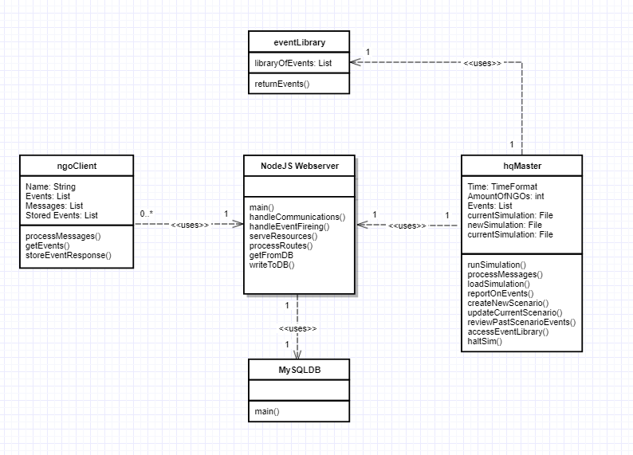

# ENGR 301 Assignment 2: Architectural Design and Proof-of-Concept

## Proof-of-Concept

---

# ENGR 301 Project 16 Architectural Design and Proof-of-Concept

**Authors:** Riley Grice, Daniel Miller, Nathan Ellison, Lachlan Keene, Tom Buurmans

## 1. Introduction

One page overall introduction including sections 1.1 and 1.2 (ISO/IEC/IEEE 42010:2011(E) clause 5.2) 
The project we have been assigned to is Project 16. Project 16 is software based and the organisation we are working for is RedR Australia. Our client organisation RedR Australia is a "leading international humanitarian response agency that selects, trains and deploys technical specialists." (As RedR states). The goal of the project is to produce a piece of computer software that will be able to assist in the disaster simulations that RedR Australia carries out. The purpose of these simulations is to train new staff to work together and to maintain a level head when under the stress of attempting to maintain order amongst natural disaster victims. During a given simulation, there are several teams of people that are assigned different roles. There is also an overseer of the simulation that watches over the teams as they solve problems together. Currently, the overseer communicates with the teams using both phones and emails. Given that there are multiple teams participating in the simulation (potentially up to 7 groups), the overseer would quickly gain a large workload. RedR would like to automate the process of running as well as tracking the simulation. Because the tasks involved in managing the simulation (communication, event initialisation, and post-simulation review) are rather tedious and normally performed by people, they are prone to errors. This then presents us with the opportunity to develop a program that would assist the human operator. This would reduce their workload considerably and allow them to focus their attention on other tasks. It would also allow for a greater sense of realism. Upon the initialisation of a simulation, teams open and read the emails they receive from the overseer and the software would play sounds that emulate the atmosphere of a real disaster zone. Having the program provide this extra stimuli would help the participants feel more immersed in the scenario. This in turn wpuld make them act as if they really were in a real world disaster recovery situation. 

### Client

Identify the client and their contact details.
Client: Regan Potangaroa
Email: regan.potangaroa@vuw.ac.nz

### 1.1 Purpose

One sentence describing the purpose of the system. 
The purpose of our software is to reduce the total workload of the overseer in the RedR Disaster Simulation and to increase immersion for its participants by automating manual tasks involved in the simulation.

### 1.2 Scope

The scope of the project is centred around delivering a disaster simulation computer program to RedR Australia. The program must be capable of communicating with other machines that simulation participants will be using. It must also track progress of a simulation and display the relative time. The final product must be delievered to the client by the end of the project (October 11th, 2019). The hardware required to develop the program is already available to the team so there will be little to no cost for this project. 

The final program will be capable of the following:

1. Ability to load dynamic simulation files, from an Overseer at HQ machine, that dictates for the details of each type of scenario and such that Overseer has main control over current simulation.
2. Operating on 1 to many machines, whereby a single machine implies no access to the internet. The total number of machines that the program will run on will depend on the number of parties participating/the number of available computers
3. Inter-communication between Overseer at HQ and NGO's at Client machines, each machine being over network infrastructure operated by RedR, and communication via superficial emails and texts between teams and Overseer at HQ. Communication may have embedded imagery and audio files.
4. Tracking for the progress of the simulation using a timescale that may be different between different simulations.
5. Custom creation of varying scenario situations.
6. Real-time interacting with scenario by Overseer.
7. Review the events that occurred in past simulations, with functionality to export scenario result.
8. Ability to function in a range of limited environments on varying hardware. 

### 1.3 Changes to requirements

If the requirement have changed significantly since the requirements document, outline the changes here. Changes must be justified and supported by evidence, i.e. they must be substantiated.
(max one page, only if required)

## 2. References

## 3. Architecture

### 3.1 Stakeholders

The development of our software product has concerns and stakeholders that must be identified so that they can be associated with each other. Project concerns will naturally impact stakeholders. However, by establishing associations between concerns and stakeholders, it means that we capable of mitigating and potentially preventing detrimental concern effects for stakeholders.

#### Stakeholders

Our project has a wide range of stakeholders, which will be assigned to the following stakeholder categories. Users, Suppliers and Operators-Maintainers-Acquires. This stakeholder category assignment ensures that we have a deeper understanding of our stakeholders. Such that we gain insight regarding the significance and the range of what the concerns for stakeholders are to be.

#### Stakeholders: User

1. "Regan (Main Client)" also as a representation of "Simulation Overseers".
2. "Trainess", are the active "NGO" participants of the simulation.
3. "RedR Simulation review Analysts", will be interacting with our program in order
   to review simulation data.

#### Stakeholders: Supplier 

4. Victoria University, utilises us, the developers, to provide for the client, such that
   they are the final supplier.
5. Developers of the Software Product including, however not limited to, Kevin S (Senior Manager),  ENGR301 Project Members (Lachlan K, Riley G, Daniel M, Nathan E, Tom B).

#### Stakeholders: Operator-Maintainer-Acquire

6. RedR Autralia.

#### Concerns

This project has many concerns that are allocated to the following concern classifications: The suitability of the architecture for achieving the system’s purposes, The feasibility of constructing and deploying the system, The potential risks and impacts of the system throughout its life cycle and maintainability and evolvability of the system.

#### Concerns: The suitability of the architecture for achieving the system’s purposes 

1. That communication between NGO to NGO, HQ to NGO and NGO to HQ fails, as a result of oversights in the web server implementation, poor design choice of server dependencies, a breakdown between the database server and the web server. 
2. That the recording of actions that NGO's perform in response to scenario events are not captured in such a way that is meaningful to the client. 
3. The intricate and contextual details for the scope of RedR scenario types is to vast and complex. That it results in the attempted processing of scenario loading files, as well as the generation of scenario review files, becoming to convoluted and thus proving to difficult to be correctly interpreted by our scenario file processing implementation.
4. That the server implementation is built such that it does not effectively support a standard typical LAN. 
5. That the functions responsible for encryption and decryption of scenario files results in the hardware resources required for these functions to perform creating additional overhead on the webserver, for a requirement that is not crucial to the product as a whole.
6. That the interfering of scenario events from HQ in real time proves impossible or extremely difficult to implement, due to this feature requiring the HQ to have a constant connection to the web server.   

#### Concerns: The feasibility of constructing and deploying the system

7. Overseer's/NGO's may accidentally terminate the running process of a simulation, resulting in any simulation progress up to the point the simulation was terminated being potentialy lost.
8. An inability to correctly serve varying user types appropriately, such that the product solution struggles to distinguish users adequately.
9. Developing a program that simultaneously supports functionality for environments that are networked and non-networked, with regards to NGO client machine quantity.
10. As the Webserver is dependent on the database server for product wide functionality, a disconnect between these entities would be detrimental.
11. A decoupling between the HQ machine and the Webserver could lead to the Overseer believing that their actions are being applied to the current simulation, when in reality they are not. 
12. Our assumption of the clients networking infrastructure, in regards to supporting our LAN server to client model of software.
13. The clients request for the Software to support communication using real-world text messages to cellular devices.
16. How the developers will be unable to install their overall software solution to this problem, as this responsibility is imposed upon the RedR client due to the deployment location being remote (Australia).
17. The method of choice for the transportation of the Software Solution to the deployment location.

#### Concerns: Potential Product Risks

16. Inability to effectively provide updates to the Software post project closure, should the client be subjected to discovering unexpected program behaviour, including bugs, defects and oversights.
17. Unforeseen Client network and environment updates that compromise the usability of our Software package.
18. Poor usability regarding UI/UX design in our automated software-based solution, results in the current manual solution to the problem proving more effective.
19. Project failure as a result of the developers acting in non-productive ways, means that the reputation of VUW and more specifically ENGR301/302 is tarnished.

#### Concerns: Maintainability and Evolvability of the System

20. If the overall system architecture does not support modularity, extensions to the core system could be infeasible.

21. Usability for client maintenance in terms of network implementation, feature implementation and for scenario loading / scenario review files.

#### Association Table Between Stakeholders and Concerns

| **Concern** # | **Stakeholders** # |
| ------------- | -------------- |
| 1.            | 1, 2, 3, 5  |
| 2.            | 1, 2, 3, 5  |
| 3.            | 1, 5 |
| 4.            | 1, 5 |
| 5.            | 1, 5  |
| 6.            | 1, 5  |
| 7.            | 1, 2, 3, 5  |
| 8.            | 1, 3, 5  |
| 9.            | 1, 5        |
| 10.           | 1, 2, 3, 5 |
| 11.           | 1, 5           |
| 12.           | 1, 5, 6       |
| 13.           | 1, 5, 6 |
| 14.           | 1, 5, 6     |
| 15.           | 1, 5           |
| 16.           | 1, 5, 6        |
| 17.           | 1, 5, 6        |
| 18.           | 1, 2, 3, 5, 6 |
| 19.           | 1, 4, 5, 6 |
| 20.           | 1, 5, 6        |
| 21.           | 1, 5, 6    |

### 3.2 Architectural Viewpoints
(1 page, 42010 5.4) 

Identify the architectural viewpoints you will use to present your system's architecture. Write one sentence to outline each viewpoint. Show which viewpoint frames which architectural concern.

**Logical** 
The logical view-point expresses the functional system requirements in a component based object model.

**Development** 
The development view-point expresses the structure and organization of the software source code, focusing on making development easier for a number of developers to manage and extend code.

**Process** 
The process view-point describes the performance and availability of the system. It addresses the system’s integrity, scalability and fault-tolerance.

**Physical** 
The physical connections between components from the system engineer's point of view.

**Scenarios**
The scenario view-point combines the four architectural components and shows how they interact utilizing a series of use-cases.

### 4. Architectural Views

### 4.1 Logical

#### Full Online Class Diagram

#### Partial Offline Class Diagram

As discussed the Logical Viewpoint pertains to expressing the functional requirements of the system. Moreover, functional requirements will be described in order to address the relevant logical concerns discussed in the concern section of 3.1. Therefore, this ensures that problems that arise for logical based concerns will be solved. Furthermore, proving beneficial to the success of this project, as indirectly the stakeholders that were associated with logical concerns will not be negatively impacted.

The diagram implicitly represents the classes "ngoClient" and "hqMaster" as classes, when explicitly they are HTML web pages, therefore relying upon local JavaScript logic as an implementation for their functions.

These addressing of these concerns is strictly limited to the governing viewpoint of Logic therefore details regarding non functional requirements have been omitted for the sake of discussion in the Viewpoint section 4.3 Processes.
#### Communication View - Concern 1

In our software solution the entities represented by the terms "ngoClient" (0..*) and "hqMaster" (1) will support intra-communication. This means that an NGO User operating at a "ngoClient" machine can communicate with a specified sibling NGO user, in addition to the Overseer operating at the sole "hqMaster" instance and vice versa. In order to support this intra-communication functionality, the diagram depicts how the classes "ngoClient" and "hqMaster" mutually feature the JavaScript function "processMessages". Whereby, potentially up to 8 (7 maximum ngoClient instances plus 1 hqMaster instance) "processMessages"  functions will coexist concurrently. This function will be implemented such that it enables all user types to receive addressed messages for displaying in addition to sending addressed messages onto the "NodeJSWebserver" simultaneously. Once the "NodeJSWebserver" detects the receiving of a new message, it's as depicted, "handleCommunications" function, will firstly process the message by writing the properties of the message into the "communications" table in the "MySQL Database" for the purpose of message recording. Lastly, the implementation of the "handleCommunications" function will ensure, post writing the message to the "MySQL Database", that the message is transferred onto the message's recipient. Finally, upon the arrival of the message at it's intended recipient, a local Web Page JavaScript function will listen to the "NodeJSWebserver" for any inbound messages. And should this function detect a new message, it will display the message to the user in question accordingly.

#### Recording View - Concern 2

A functional requirement of our software solution is to meaningfully cache how NGO users acted in response to Simulation Events occurring. This caching then enables Overseer users (and or stakeholder 3), to review NGO actions for training purposes. The software solution will support this requirement, as dictated by the following overall class diagram description. Firstly, Simulation events (with NGO recipients) are triggered by the "hqMaster" instance locally, using the JavaScript function "runSimulation()". From there the event gets inserted into the "Events" table in our MySQL Database, as an event by utilising the "NodeJS Webserver" function titled "handleEventFireing", as the intermediate step. This function will then deliver scenario events to the relevant "ngoClient" instances, as these instances invoke the JavaScript function "getEvents" in which is paired in tandem with the "handleEventFireing" NodeJS Webserver" function, for inbound event receiving.   Once an event has been detected, at the end of an NGO client, a combination of HTML and JavaScript will present the event to the user in an effective manner. In the process of doing so, the "ngoClient" class invokes the function "storeEventResponse", as such NGO users will be supplied with functionality to potentially respond to how they acted in regards to submitting evidence of their reaction to the event. Moreover, if and when the "storeEventResponse" function is interacted with, it concludes with passing the reaction evidence back to the "NodeJS Webserver". Finally, the Webserver will store this reaction evidence in the corresponding NGO rection, column-specific event row, of the occurred events Database table. In summary, this enables NGO performance training reviews.

#### Land Area Network View - Concern 4
The entirety of the generated class diagram is predicated on the client's requirement statement that the target deployment environment is a LAN, that features multiple adequate instances of Windows-based computers. A core principle of LAN's is that given a relatively limited set of computers, (that in themselves form an interconnected LAN) each computer within this LAN set has the capacity to transmit data within the LAN, without being subjected to interference, concurrently. This idea of interference-free, concurrent data transmission being supported then guarantees that the class diagram fundamentally is possible. And as such, the diagram honours this core LAN principle specifically,  by firstly depicting a relationship between the "NodeJS Webserver" class to the "ngoClient" class being 1 to Many. And lastly depicting the relationship between the "NodeJS Webserver" class and the "hqMaster" class being 1 to 1. Whereby, these two relations imply concurrency is supported. Therefore, we as developers are confident that this class diagram in it's entirety is possible, as we progress in our development.

#### Live Interfering View - Concern 6
Our software solution will enable the Overseer at "hqMaster" to have the capacity to impose real-time editing of the sequence, as well as the choice over usage of events in a current scenario. The following logical discussion serves as proof of this. Given that an Overseer has followed the process of loading a simulation file into an "hqMaster" instance, as ensured for by the JavaScript function titled "loadSimulation"; they are presented with an interactable timeline in which showcases the current sequence of scenario events. Interactable meaning the modification of events in terms of the supporting of event reshuffling with regards to time, the addition of new events and the removal of current events. Furthermore, these interactable aspects of the timeline will be backed up by the logical implementation within the function titled "updateCurrentScenario". As such, once a change of events has occurred in the interaction UI, this function is invoked to make any necessary relevant changes to the current scenario. The implications of this feature are such that there is potential for NGO users to be affected, if these users are acting out an event (in reality) that is currently occurring (eventStartTime < currentTime < eventEndTime), however, has since been modified. Therefore, "updateCurrentScenario" will immediately notify relevant "ngoClient" classes that a change in the current event has occurred as an imperative and this will be by utilising the "NodeJSWebserver" as an indirect medium from "hqMaster".

#### Identification Of Varying NGO User Types View - Concern 8

A functional requirement of the software solution is to implement a feature that allows unique NGO users who implicitly and mutually share the class "ngoClient" to be differentiated from one another, as shown in the "NodeJSWebserver" to "ngoClient" relation with multiplicity. Once a new scenario simulation has been configured from the "loadSimulation" function of the "hqMaster" class, the Overseer is presented with an IP address from which they are to inform their NGO users of, in order for them to connect to the "NodeJSWebserver" and by extension the "hqMaster" instance. This is when the "main" function of the Webserver is invoked because once individual "ngoClient" instances navigate to the supplied IP address (as well as providing an identifying NGO name), this function will detect new "ngoClient" instances and will store "ngoClient" network reference information, in order to differentiate each instance. Next, this function will also pass the aforementioned identifying name back onto the "hqMaster" class instance, whereby the "hqMaster" will store any transferred unique identifier names. Therefore, full functionality across the entirety of the system is guaranteed as now the "hqMaster" and the "NodeJSWebserver" have the capacity to map network references to actual "ngoClient" instances.

#### Simultaneously support for Networked and Non Networked Environments View - Concern 9
A functional requirement of the final software product is to enable multipurpose functionality for supporting environments that do and do not feature a LAN of computers. As such, our software solution must be highly adaptable to these mutually opposing network environment. However, this challenging aspect of adaptability with regards to network environment will be accounted for. As by observing the Partial Offline Class Diagram and comparing it with the Full Online Class Diagram, this reveals that logically the features required to enable multipurpose network functionality, for the software as a whole, is as follows. Firstly, in the instance of a given scenario simulation in a non-networked environment (featuring a sole "hqMaster" machine) this concept is reflected by the offline diagrams omission of intermediate dependencies to the Webserver and Database. And secondly, intra-communication by utilising messages is disabled entirely. These stripped limited features of the offline version are in stark contrast to the full functionality of the online version. However, this does not imply that simultaneous support for both versions is impossible, and the following discussion supports this claim. Because our implementation will be built such that in the process of an "Overseer" user configuring a new scenario for simulating, they will be forced to choose which "mode" (being online or offline) the desire, based upon the capacity of the network environment that they are currently situated within. Whereby, naturally, choosing online will enable full software functionality, as shown in the diagram: Full Online Class Diagram and choosing offline will enable partial software functionality, as shown the diagram: Partial Offline Class Diagram.

### 4.2 Development

The two primary components of the disaster simulation program are the front and back end. The front end consists of local logic (including user interfaces), and external logic for communicating with the back end. The back end consists of a server to distribute data between each client, and a database server for storing the data.

**Component Diagram (fig 2.1)**

**Dependency Diagram (fig 2.2)**  

**Front End:**

The front end of the system is split into two different client types, HQ and NGO. The two clients are very similar, with the NGO client being a more cut down and simplified version of HQ due to fewer requirements. Because of this, many of the components developed for the HQ client can be reused for the NGO client.

Both clients depend on local logic in the form of local JavaScript libraries to display data to the user. These libraries are the event graph, inbox list, scenario editor graph and PDF viewer. The HQ client utilizes all of these libraries, whereas the NGO client only needs the inbox list and PDF viewer. As the requirement for these two components is identical for both clients, the two library's can be reused with no modification. 

External logic is used within both client types to communicate with the back end system. Each client is not visible to any of the other clients, so all data sent between the HQ client and NGO clients is propagated through and saved by the server. For this reason, the external logic is dependant on the server within the back end system being available. Functions for sending message events between clients via the server will be the same for both HQ and NGO client types. These functions can be reused, along with functions for transmitting scenario data directly between the server and a client, such as the time remaining in a simulation. Additional External logic will have to be extended for the HQ client, for transmitting scenario commands and data regarding scenario editing.

**Back End:**

The back end of the system consists of a server to control the flow of data through the system, and a database to store the data.

The server is responsible for distributing content between each client and the database. It interacts with the database via MySQL, saving and loading relevant data on behalf of the individual clients. Because of this, the server is dependant on the database to function correctly. The server utilizes an HTTP server and Socket.IO for real-time, bi-directional communication between itself and each client with express web-framework.

The database stores all simulation data in a set of tables. User data, scheduled events, sent events, log data and the editor event library are all stored in tables in the database. As the database is passive, it is dependant on the server implementation to maintain and utilize its contents.

   

**Concern 20: Project failure as a result of the developers acting in non-productive ways, means that the reputation of VUW and more specifically ENGR301/302 is tarnished.**

Project failure is a risk, and would likely be caused by a lack of organisation and communication within the team. This would result in a dissatisfied client, and reflect poorly upon the course. This risk can be mitigated however, by the proper implementation of a project management strategy. Fully utilizing GitLab is the first step for this, in order to plan the project and allocate work between team members. Milestones within GitLab will be used to monitor components of the project over the long term, whereas issues will be used to allocate and track individual tasks within a milestone. Issues will be assigned based on the current task, and frequent commenting on these will keep all team members up to date with the progress of each issue.

**Concern 21: If the overall system architecture does not support modularity, extensions to the core system could be infeasible.**

If a system is not modular in design, the implementation of additional components would be very difficult. This would require heavy modifications or the complete replacement of other components, each with multiple complicated functions and many dependencies. Alternatively, modular design (fig 2.1) separates each component into specific subcomponents. Each component is simpler, with a single specific task and only dependant on other components located in a layer below it (fig 2.2). This makes it much simpler to implement new components to the pre-existing system. Any individual component relevant to the system could be added within the appropriate super-component and implemented with little modification due to the more simplified dependencies. An example of this within (fig 2.1) would be adding another table under the database component or adding a new visualisation component within local logic for either client type.

**Concern 22: Usability for client maintenance in terms of network implementation, feature implementation and for scenario loading / scenario review files.**

After completion of the project, the client may wish for a third party to implement new features or fix problems found in the originally deployed version. If the components within the project are assembled in such a way that this is difficult to do so, the client may be forced to abandon the system entirely for another option. To make the project more maintainable it will be constructed a way it is easier to understand. A modular structure is excellent for this, as each component is simpler and easier to remove or add to the system. Relevant documentation will also be supplied for each component in the system, to assist future developers in understanding how they work.

### 4.3 Process
...

### 4.4 Physical

The Physical viewpoint will take into account the software's physical aspects and issues that may occur during and after the deployment of the software. A deployment diagram demonstrates both the offline and online modes will run on the physical infrastructure. However, both offline and online versions run simultaneously during the program, meaning a internet tab can be opened on the host server's computer and on another computer given it connected to a network that can connect to the host. The deployment diagrams for both online and offline are separated to see how they're different when the program is running. 

**Deployment Component Diagram** 

**Deployment Offline Functionality Diagram** 

Offline:
One device node will be used in the offline version. This will be a computer that runs all the executable environment nodes. The server will run on the device, it will connect all the other execuatble envrionment nodes such as the HQ Interface, the Database and the NGO Interface. All functionality will be linked through the server's connection within the device hosting the server.

**Deployment Online Functionality Diagram** 

Online:
There will be multiple devices that host the executable environment nodes. There will be one device used to host the HQ Interface, the Database, and the server. To host the NGO Interface another computer will be used as the device. The NGO Interface will use the server to connect to the HQ Interface and other NGO Interfaces. This server will be a LAN.

**Physical Concerns:**

**Multi-purpose Network View**

Concern 9 - Developing a program that simultaneously supports functionality for environments that are networked and non-networked, with regards to NGO client machine quantity. 

If the program is unable to run both and offline and online functionality over a working LAN, the effects would cause the program to have only one option to run a simulation. This would affect RedR's training capabilities.
Due to the program not being able to run an online and  and offline function simultaneously then the project would have to develop two separate programs. One program would run on one computer that does not require a LAN, the second program would run a server
over a LAN connecting to multiple computers. This would increase the size of the project significantly, requiring perhaps duplicate code between programs. 

**Current Client Infrastructure View**

Concern 12 - Our assumption of the clients networking infrastructure, in regards to supporting our LAN server to client model of software.

The client running in the deployment location might not have a standard LAN where the program's JavaScript cannot run on or potentially ther is no LAN at all. This would disable the online mode of the program and not allow for the server to run its operations. If there is no connection to the internet for the computers in the deployment location then creating one would be necessary to have online mode run, as establishing a network between computers is crucial. Going to the deployment location would have a great cost (flights to Australia), then asking RedR to hire a company to set up a network for them is the best solution. If there is a network but it cannot run the Javascript server then the project team would have to pick either two options. The first option is to change the program so it runs on RedR's network which would require a detailed description of how their network functions and is structured. The second option is to get RedR Australia to get get a new standard network where the server can run on.

**Texting View**

Concern 13 - The clients request for the Software to support communication using real-world text messages to cellular devices.

In real world disasters, much organization is done with emails as well as text messages. Texts have the benefit of being relatively cheap compared to mobile data usage for emails. Setting up texts in the simulation can be done using Javascript and the Node.js functions. However, this requires the project team to buy specific phone numbers and sim cards online, and with no budget in the project this means we won't be able to implement it. There will be more concerns if it is implemented as well because if the software for the simulation is in different countries than more and more phone numbers will have to be bought. Until budget changes happen, there will cannot be a implementation of texts within the simulation. To implement the texting for different countries would require the project team to design each server that runs in a different country and perhaps if there are multiple simulations in each country, more sets of phones are needed. This makes implementing texts and phones into the program very costly and would require constant micromanaging such as keeping track of sim cards numbers and the cost to run the sim cards after deployment which the team cannot do once the project is over.

**Remote Deployment View**

Concern 14 - How the developers will be unable to install their overall software solution to this problem, as this responsibility is imposed upon the RedR client due to the deployment location being remote (Australia).

The first place where the fully developed simulation will be deployed is in Australia. The client has specified that the location could be remote and in a region where it will be difficult to deploy. This location in Australia may not be connected to internet or have a network that is not connected to the outside internet, this could make emails and online repositories unable to deploy the software in the remote locations. Flash drives will most likely have to be used to transport the software to the final location. Flash drives have a risk of being lost, broken or stolen, and also have to take time to be delivered to the deployment location.

**Transportations of Software View**

Concern 15 - The method of choice for the transportation of the Software Solution to the deployment location.

The software is to be transported to the deployment location in Australia. There are three options for transporting the data to Australia, the first being emailing which is the quickest option, however it would have to be sent through the team's ecs accounts to the client due to the contract keeping the project private. An issue could arise if the internet is down, but this is minor and can quickly fixed. The second option is to send the software to Australia in a flash drive delivered in the mail. Delivering flash drives in the mail has its own problems as it takes several days for new software to reach its destination to be tested or run for a simulation, the flash drive also has the chance to be lost, broken or stolen. The thid option is to have to have it on on a Gitlab online repository however, the size of the software may be too large to be placed in the repository. The project team has already had an issue where the size of the file is too large to be added into a repository but managed to deal with it by zipping up the software and reduced the size by 75%, allowing the software to be stored on the Gitlab. 

**Post Project Updates View**

Concern 16 - Inability to effectively provide updates to the Software post project closure, should the client be subjected to discovering unexpected program behaviour, including bugs, defects and oversights:

After the final deployment is sent and the project is finished, there may still be bugs, defects, bugs and oversights. This will be an issue for users during the simulation and may hinder training sessions for NGOs, this could potentially lead to the program not being used at all or only in limited ways. To avoid as many issues with the behavior of the program after the final version there will be lots of testing during the development of the software. Testing such as logging, black and white box testing and usage by RedR can help resolve and correct the issues within the behavior of the simulation before the final version is sent.

Concern 17 - Unforeseen Client network and environment updates that compromise the usability of our Software package.

It is important for any software program to be kept updated. This ensures that the simulation program will run when there a OS, JavaScript or HTML updates. When the project is finished and handed to RedR Australia the team that has worked on the project will not be able to update the project and ensure that it runs smoothly on future updates as the team will have finished and left the project. This will be a risk that we have to take because we are unable to maintain the project for RedR Australia and ensure that it runs smoothly on future updates of the OS it will run on.

### 4.5 Scenarios
...
The RedR Simulation system has many different functions, and thus has numerous different use cases to accompany it. Arguably, the most important ones are the
sending of messages from the HQ (Headquarters) computer to the NGO (Non Government Organisation) computer, as well as the HQ creating a new scenario. Depending
on the availability of a network connection in the location where this software is going to be used, these two seperate entities may be one or many processes. The network and physical connections between the computers will be the responsibility of the client and their associates. We can create a scenario from each use case. In this instance, we'll use the two most important use cases of the system (HQ sending messages to an NGO and HQ creating a new scenario). These functions are supported by the architecture by having these functions delegated to dedicated components of the program. 

If one of the NGO users wishes to send a message to the HQ, they simply navigate to the client sender component (visible in the above diagram). From there they may compose their message and send it to the HQ. The message will then appear in the HQ receiver component. These components may be divided among processes running on different machines. If there is no network connection available, all of the data will be contained on one machine within one process. The program will almost mimic an email or instant messaging service, but will be enitrely dedicated to the purposes of humanitarian organisations and will also have the integrated simulation timeline. 
If the HQ user decides that they wish to add a new simulation scenario to the program, they can accomplish this using the seperate ScenarioCreator component of the system. This will be a standalone application that will run independently of the main simulation program. The scenario creator will only run on the computer that is running the simulation program as the HQ. This is because only the HQ will be allowed to have access to the scenario creator program. 

(Concern 16) The most obvious concern with any computer program is that there will be bugs and defects within it that weren't caught and resolved before release. This could happen because of approaching deadlines causing the team to rush and make mistakes.  
(Concern 18) The client may also lose the ability to use the software by not having enough/any hardware available to use it. We have no control over the client's circumstances, and this is simply a risk that we will have to take. 
(Concern 19) It might end up that the client finds the interface of the program too hard to use, and will prefer to resort back to their old way of working, making the entire project redundant. 
(Concern 20) The client may find another solution to their problem that fits their needs better. This alternative may (for example) be cheaper, easier to use, easier to train other people to use or takes less time to aquire.  
(Concern 21) The project may also fail due to team members not being able to co-operate or work efficiently enough to meet the deadline for deployment.  
## 5. Development Schedule

_For each subsection, make clear what (if anything) has changed from the requirements document._ If unchanged, these sections should be copied over from the requirements document, not simply cross-referenced.

Schedules must be justified and supported by evidence; they must be either direct client requirements or direct consequences of client requirements. If the requirements document did not contain justification or supporting evidence then both must be provided here.

### 5.1 Schedule

Identify dates for key project deliverables:

1. prototype(s).
1. first deployment to the client.
1. further releases required or specified by the client.

The team discussed scheduling in regards to project deliverables with our client. The client did not specify any dates for releases other than the final deadline of the 11th of October, 2019. Given this, the team will endeavour to develop a minimum viable product as soon as possible so that we may provide it to the client and allow them to provide us with feedback so that we may further develop, and continue to deploy it, before October 11th. 

### 5.2 Budget and Procurement

#### 5.2.1 Budget

Present a budget for the project (as a table), showing the amount of expenditure the project requires and the date(s) on which it will be incurred. Substantiate each budget item by reference to fulfilment of project goals (one paragraph per item).
Our project does not require a budget as it is purely software built using free tools.
Our client does not have a budget in mind from RedR themselves. We have decided to face that if and when it comes up, due to the likelihood of us needing a budget.

#### 5.2.2 Procurement

Present a table of goods or services that will be required to deliver project goals and specify how they are to be procured (e.g. from the School or from an external organisation). These may be software applications, libraries, training or other infrastructure, including open source software. Justify and substantiate procurement with reference to fulfilment of project goals, one paragraph per item.
(1 page).

### 5.3 Risks 

Identify the ten most important project risks: their type, likelihood, impact, and mitigation strategies (3 pages).
| Risk                                                         | Likelihood | Severity     |
| ------------------------------------------------------------ | ---------- | ------------ |
| A large number of project members are sick at critical times during the project, hindering progress resulting in us falling short of delivery goals. | Moderate   | Serious      |
| Unforeseen major changes to requirements prompting a redesign of the system. | Moderate   | Tolerable    |
| There is a natural disaster and Regan gets called out into the field to help, making it impossible to communicate with him. | Low        | Serious      |
| Expansion in number of users, or amount of data stored, requires paid services, creating unexpected budget requirements. | Moderate   | Tolerable    |
| The project requires more time to develop than expected, causing us to fall short of delivery goals. | High       | Serious      |
| Developed program has too big a learning curve, making it too difficult for users to use and forcing the client to discard it. | Moderate   | Catastrophic |
| The team focuses on non-required features and functionality (such as visuals), restricting us from finishing on-time. | Moderate   | Serious      |
| The developed software ends up requiring hardware investment for testing, making it too costly for the client. | Low        | Catastrophic |
| Employee turnover at RedR resulting in the termination of our project. | Low        | Catastrophic |
| A disaster at VUW restricting access to our files.           | Low        | Serious      |

| Risk                                                         | Strategy                                                     |
| ------------------------------------------------------------ | ------------------------------------------------------------ |
| A large number of project members are sick at critical times during the project, hindering progress resulting in us falling short of delivery goals. | Keep up team discussion and documentation so that each member knows everyone's role, a sick team member's work could then be picked up by the rest of the team. |
| Unforeseen major changes to requirements prompting a redesign of the system. | Keep up regular communication with the client about requirements, questioning what they need, especially early on, to lower the likelihood of an unforeseen change. |
| There is a natural disaster and Regan gets called out into the field to help, making it impossible to communicate with him. | Retrieve concrete requirements from Regan early on so that we could carry on the project with little to no input from him. |
| Expansion in number of users, or amount of data stored, requires paid services, creating unexpected budget requirements. | Research such possibilities and make the client aware. Ask for a potential budget from the client. |
| The project requires more time to develop than expected, causing us to fall short of delivery goals. | Investigate adopting complete components from elsewhere, make as much use from available resources as possible. |
| Developed program has too big a learning curve, making it too difficult for users to use and forcing the client to discard it. | Assign time near the end date of the project specifically for user interface design and test with people outside the team. |
| The team focuses on non-required features and functionality (such as visuals), restricting us from finishing on-time. | Assign time to specific parts of development with correct priorities based on requirements. This will keep us on track. |
| The developed software ends up requiring hardware investment for testing, making it too costly for the client. | Discuss with the client and the school about their possible testing facilities. |
| Employee turnover at RedR resulting in the termination of our project. | This event is completely out of our control and there can be nothing done about it if it happens |
| A disaster at VUW restricting access to our files.           | Incorporate a version control system such as GitLab that stores files offsite. This can be accessed remotely. |

If the project will involve any work outside the ECS laboratories, i.e. off-campus activities, these should be included in the following section.

### 5.4 Health and Safety

Document here project requirements for Health and Safety. All teams must state in this section:

1. How teams will manage computer-related risks such as Occupational Over-Use, Cable management, etc.  

Occupational Over-Use can be avoided by not working for lengthy periods of time without a break. The team has agreed to 2 10 minute breaks for each 4 hour lab session to break up the time. During this time, team members can go for a walk, get a drink, eat, or anything to aid their general wellbeing. This is stated in our team contract.
To avoid creating tripping hazards with poor cable management, the team will endeavour to keep cables off the floor where possible. The ECS computer labs are a good example of this. If not possible, the team should be made aware of any cabling around the teams working space by the owner of the cable. Team members should also scan the area around them when arriving at the space to work.

2. Whether project work requires work or testing at any external (off-campus) workplaces/sites. If so, state the team's plans for receiving a Health and Safety induction for the external workplaces/sites. If the team has already received such an induction, state the date it was received. 

The teams health and safety induction took place on 21/03/2019 and was presented by the school's Safety Officer Roger Cliffe.
Our project does not require us to go off university campus. Our lab work is done on VUW Kelburn campus, and our meeting with Regan take place on the VUW Te Aro campus.

3. Whether project work requires the team test with human or animal subjects? If so, explain why there is no option but for the team to perform this testing, and state the team's plans for receiving Ethics Approval _prior_ to testing.

Our project will be tested with human subjects. This is by requirement of our client, Regan. Once the team has developed a functional version, it will be used in the real world running disaster simulations. These tests will be fully conducted by Regan making it his ethical requirement to ensure the safety of the people using the software.

Also, the document in this section any additional discussions with the School Safety Officer regarding Health and Safety Risks. Give any further information on relevant health and safety regulations, risks, and mitigations, etc.

#### 5.4.1 Safety Plans

Safety Plans may be required for some projects, depending on project requirements.
Project requirements do not involve risk of death, serious harm, harm or injury.

## 6. Appendices

### 6.1 Assumptions and dependencies 

One key assumption that we will have to make is that the computers that are being operated during the disaster simulation are capable of running the software that will be produced. It is also assumed that RedR will be responsible for maintaining their own network infrastructure and will be responsible for getting the software back online should it go down. 

The client suggested using KoboToolBox as a framework for the program, though the team has yet to decide whether to actually use this. This choice will be made at a later date when the time for deciding how to build the system comes. 

Client computers support basic sound playback functionality.

Client computers can support video capturing if client makes this feature mandatory.

### 6.2 Acronyms and abbreviations

Overseer: The individual responsible for communicating with each of the teams participating within the simulation.

RedR Australia: An organisation that selects, trains and deploys staff to assist in disaster situations, and is associated with the client. 

HQ: Head Quarters in the simulation, where the command centre of program is run from.

NGO: Non Government Organisation or Organisation, for short, is the name given to teams of participating trainees in the simulation.

## 7. Contributions

A one page statement of contributions that lists each member of the group and what they contributed to this document.

---
